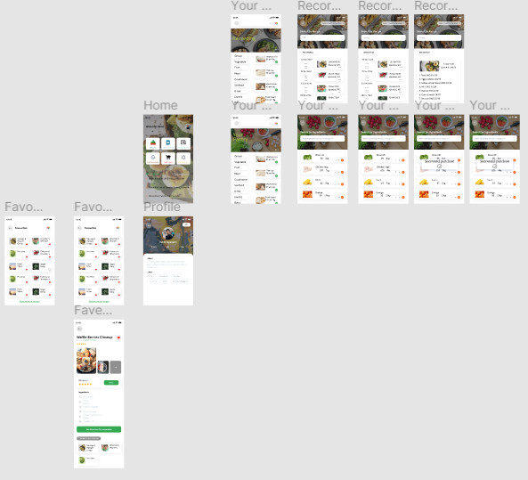
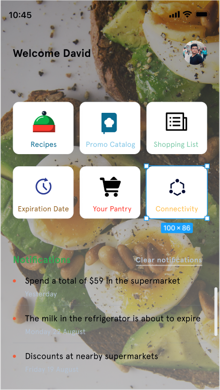
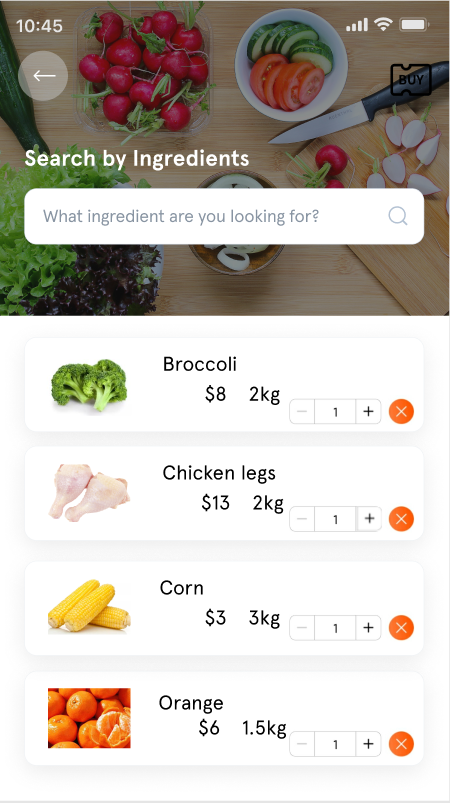
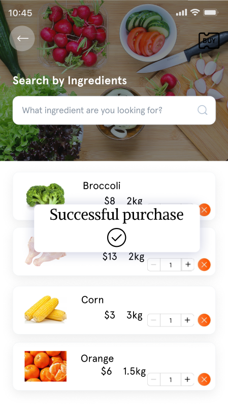
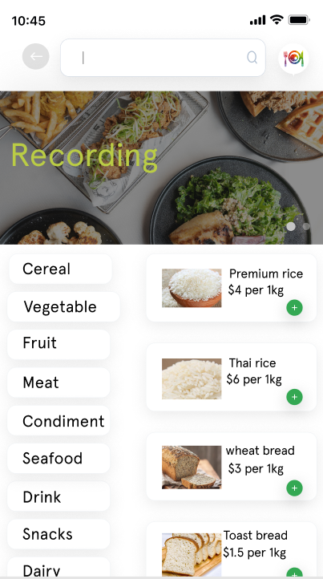
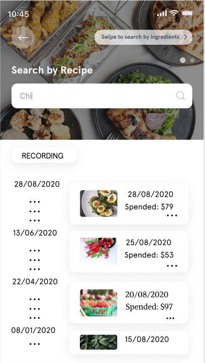
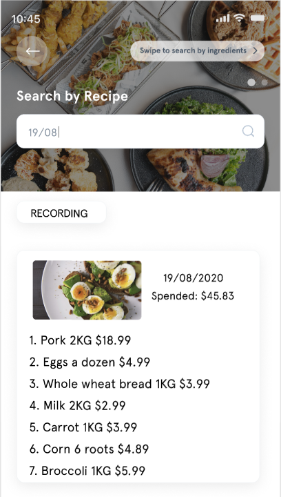
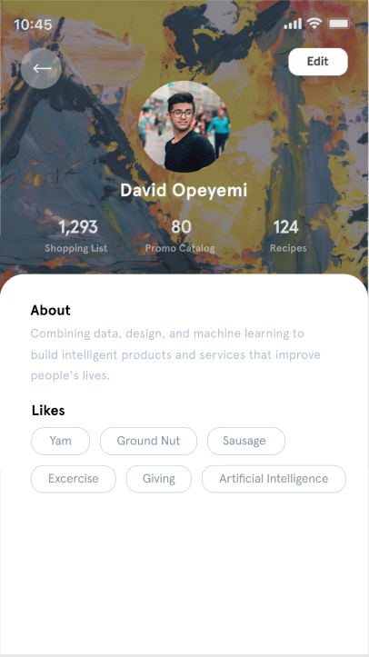
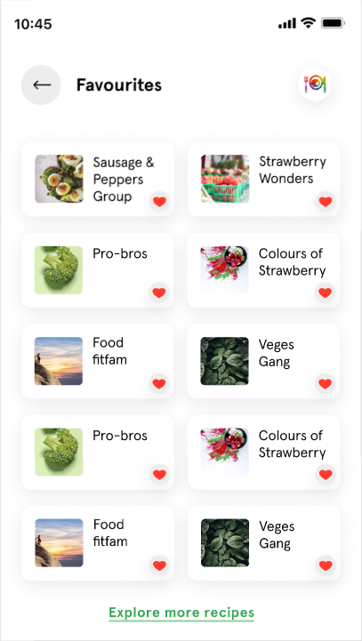
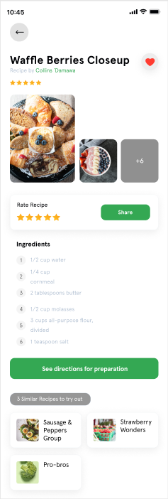

# -IV---Soupafoods--A2

<h2>Your Pantry</h2>

In this interface, the system lists almost all the foods that can be bought in the market (categorized according to the type of food). The user can use it as a "shopping cart", plan the food to be purchased in advance, and add it to this page. And use this as a checklist to purchase online or go to the supermarket in person. Of course, it is not just as simple as adding the food that needs to be purchased, users can clearly see the price corresponding to each food, and when choosing different specifications, the price will also change. 

In addition, we will upload all the ingredients added by the user in the past year (by date index) to the Cloud, and check the market price and food one-to-one correspondence. And the system will draw a table to record changes over time. The advantage of this is that users can check which ingredients they have purchased in the past at any time, and can even meet the needs of the kitchen account book.

<h3>Scenario 1</h3>

Jerry is a 38-year-old single employee. Due to work needs, he goes to work very early almost every day and leaves at 7 in the evening. If he goes to the supermarket to buy ingredients after he gets off work, it will be very late. Nevertheless, he still likes to cook at home, and when he is free, he will go to the supermarket to buy a lot of food. But because he buys too much at one time and cannot finish eating in a short time, the food will deteriorate and cause waste. This makes him uncomfortable. He hopes that somehow, he can buy ingredients online and cook at home.

When Jerry uses our software and clicks on the "Your Pantry" interface, he can view nearby supermarkets and browse the goods and food in the supermarkets. He carefully browsed various foods, such as vegetables, fruits, meat, etc. He found that there is almost no difference in the types of food here from ordinary supermarkets, and the prices are very similar. It also supports home delivery. He only needs to determine the food that needs to be purchased in the mobile app, and the courier will deliver it. These functions made Jerry very happy, and he began to try to use them. Whenever Jerry is an hour before leaving work at night, he will take a moment to search for ingredients in the "Your Pantry" function of the app and plan his dinner. When he got home, the courier just delivered the food so that he could start cooking directly, saving him time to go to the supermarket to buy food after getting off work. Jerry believes that the software has helped him solve many problems related to kitchen ingredients and greatly improved his quality of life. He is very satisfied.

<h3>Scenario 2</h3>

Tom is an international student in Melbourne. He lives alone in a suburban apartment building. In his own country, online shopping is very convenient. It is no exaggeration to say that he can buy all the products on the market on the Internet, even hot-pots like China. They can easily buy them, waiting for the delivery staff to ensure all the ingredients and soup base are delivered to home... But when he came to Melbourne, he found that life here has changed a lot from before. Online shopping has become no longer convenient, and there are no supermarkets, markets  surrounding areas where he lives. This puzzled him. So, he searched on his phone, looking forward to a software that could solve his problem.

When Tom saw our app, he wanted to give it a try, downloaded it and registered it. He found that there was a function "Your Pantry" in it. At this time, the system asked him for GPS permission. He agreed to this request. After only 2 seconds, the names of several supermarkets in Melbourne were displayed, and all the supermarkets were displayed. The variety of products and the price of information surprised him. Tom quickly understood the purpose of this function, and selected some necessities and food, added them to the "Your Pantry" interface, and then placed an order for payment. After about half an hour, a dedicated delivery person delivered all the goods just purchased. In addition, he also discovered the "recording" function, and clearly recorded the consumption record just now, showing the date, specific products, food, quantity/weight, etc. in detail. Tom thinks this can also help him record weekly or monthly consumption. Since then, Tom rarely goes to the supermarket anymore. The food he wants to buy is all purchased online through the app. He is so happy, and sighs that it finally resembles his domestic life before.

<h3>validation criteria 1</h3>

As a user, I want to be able to buy food online so I can save time in the supermarket

The user opens the "Your Pantry" interface with online shopping,

The system will apply for permission from the user, and the user needs to allow the app to use the GPS positioning function

The app will confirm the user’s location,

Search for nearby supermarkets,

And connect to the supermarket’s network to get product information and prices,

The user browses the product list and selects the product to be purchased to join "Your Pantry"

Click the "Buy" button in the upper right corner to place an order

Complete the purchase

<h3>validation criteria 2</h3>

As a user, I hope that online shopping can be realized through a certain software, and every consumption information can be automatically recorded

The user downloads and registers the software, the system requests the use of GPS function, the user needs to agree to the request

The system page displays nearby supermarkets and displays all product information

The user selects the desired food/product

Complete the purchase

Waiting for the delivery person to deliver

The system will automatically make a statement, and upload the detailed information of this consumption to "Recording"

Users can view it on the "Your Pantry" interface

User can choose whether to record or upload to the cloud

Function completed

<h3>Sketch </h3>

 

 

<h3>Design Diagrams</h3>

This is the main interface of the application. When the user opens the application, this screen will appear. We display six main functions in the main interface, and the user can directly click to access. At the bottom, we also added recent system messages, including recent consumption records, food shelf life, etc. Users can also access their personal information interface and operate with a high degree of freedom.

The user uses the "Your Pantry" function, which includes "shopping cart" and "recording".

"Shopping cart" means that the application will search for nearby supermarkets, match it online, and display the latest price information of the product/food. Users can directly select the food they want on this interface and then buy it.

Click the "Buy" button in the upper right corner, and the food selected in "Your Pantry" will be purchased.

After the purchase is successful, click the "Confirm" button to return to the "Your Pantry" main interface.

"Recording" can record all shopping records of users in the past year, detailed dates, product types and prices. Upload through the cloud to protect user privacy. The user can also manually add or delete, or even close the "recording", all choices are left to the user.

On the "recording" page, users can directly enter the time through the search box at the top, such as "19/08", and then they can accurately find the records purchased through "Your Pantry" or manually uploaded on that day.

Locate "19/08" to accurately check the purchase details of the day.

On the user's personal information page, the user can customize the avatar, background image, and personality label. The system lists the shortcut buttons of "Recipes", "Favorites", and "Promo". The user can click to enter and select operations. Everything is done in one step.

View the categories of the recipes that have been favorited, and you can remove or add to favorites on this operation page.

Check out the recipes previously added to the collection. The recipes describe the production steps and process in detail.

